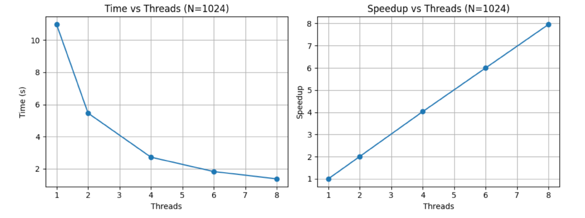
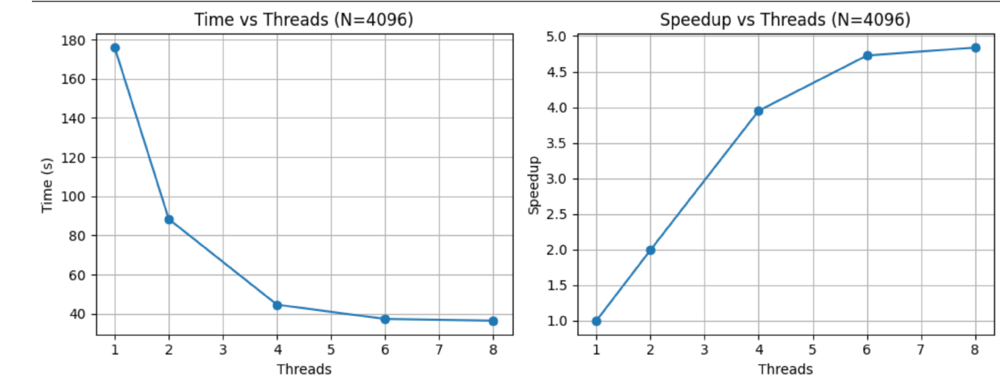
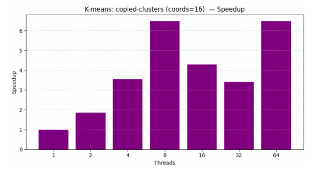
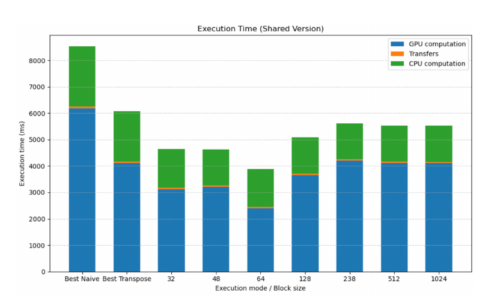
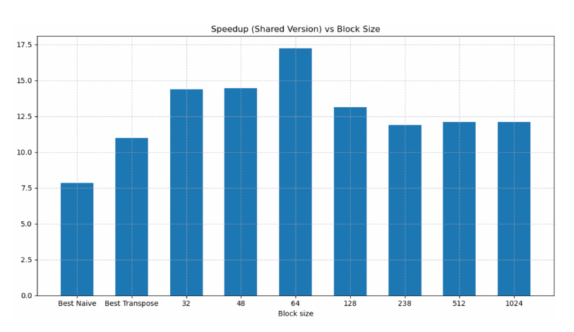
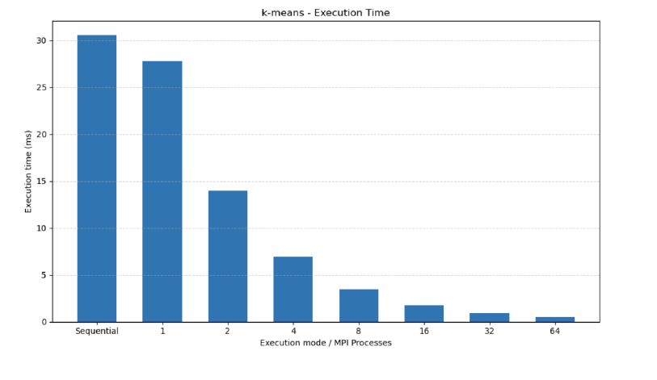
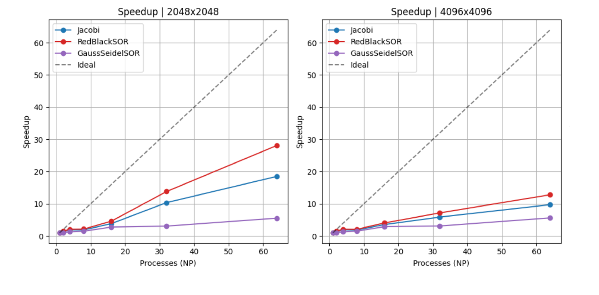

# Parallel Systems Optimization: OpenMP, CUDA, and MPI

## Overview
This repository contains a collection of high-performance computing implementations developed to explore and benchmark shared-memory programming, GPU acceleration, and distributed computing. The project systematically applies parallelization strategies to classic algorithms, addressing critical architectural challenges such as false sharing, non-uniform memory access (NUMA), cache invalidation, and interconnect bottlenecks. 

## Key Technologies
* **Languages:** C, C++, CUDA
* **Frameworks & APIs:** OpenMP, MPI, POSIX Threads (pthreads)
* **Concepts:** Thread Binding (Affinity), Lock-Free Data Structures, Memory Coalescing, Ghost Cell Exchange, Task-Based Parallelism

---

## Core Implementations & Benchmarks

### 1. Shared Memory Parallelization (OpenMP)
* **Conway's Game of Life:** Parallelized grid generation using OpenMP. Achieved near-linear speedups for optimal grid sizes (1024x1024) but identified memory bandwidth limitations on large grids (4096x4096) where the problem transitions to being memory-bound.
  
  
* **K-Means:** Migrated from a naive parallel loop to an optimized implementation utilizing thread-local arrays and `GOMP_CPU_AFFINITY` to maximize NUMA locality and eliminate false sharing. 

  
  

* **Floyd-Warshall (Recursive):** Implemented nested task-based parallelism using OpenMP Tasks. Benchmarked various block sizes to balance compute load against the overhead of thread management.

### 2. GPU Acceleration (CUDA)
Accelerated the K-Means algorithm through progressive hardware-aware optimizations:
* **Transpose Version:** Restructured the dataset from row-based to column-based indexing, enabling warp memory coalescing and drastic performance improvements over the naive kernel. 

* **Shared Memory Version:** Stored cluster centroids in the GPU's low-latency shared memory, reducing global memory accesses and tuning the block size to maximize Streaming Multiprocessor (SM) occupancy.
* **Full-Offload (All-GPU):** Eliminated the CPU-GPU communication bottleneck by moving the centroid update phase entirely to the GPU device, utilizing atomic operations to finalize the pipeline.

  
  

### 3. Distributed Computing (MPI)
* **Distributed K-Means:** Implemented a scalable clustering model using `MPI_Scatterv` to distribute uneven dataset chunks and `MPI_Allreduce` to synchronize global centroids and convergence states.
  
  
  

* **2D Heat Equation:** Simulated heat diffusion utilizing a 2D Cartesian process topology. Implemented and compared three numerical methods:
  * *Jacobi:* High communication overhead with slow convergence (requires 236,000 iterations).
  * *Gauss-Seidel SOR:* Faster convergence but heavily serialized due to step-by-step data dependencies causing massive communication wait times.
  * *Red-Black SOR:* The optimal solution. Achieved rapid convergence (1,201 iterations) and excellent parallel scaling by decoupling grid updates into independent "Red" and "Black" phases.
  

---

## Performance Highlights
| Algorithm / Context | Key Optimization Applied | Resulting Behavior |
| :--- | :--- | :--- |
| **K-Means (OpenMP)** | Thread-local initialization & CPU Affinity | Eliminated false sharing; achieved linear speedup up to 8 threads on a single NUMA node. |
| **K-Means (CUDA)** | Full-Offload & Memory Coalescing | Bypassed Amdahl's bottleneck by eliminating iterative CPU-GPU PCIe transfers. |
| **Heat Eq. (MPI)** | Red-Black SOR Method | Reduced iterations to convergence from 236,000 (Jacobi) to 1,201. |
